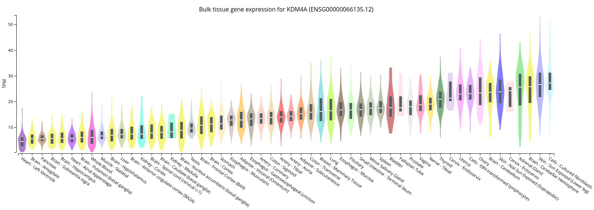
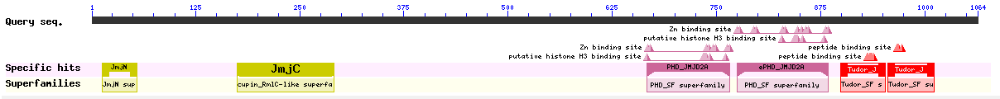
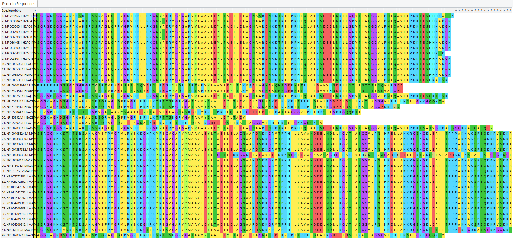
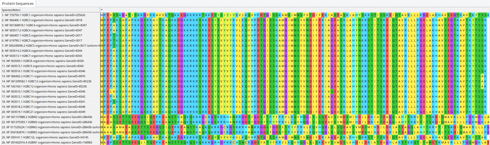
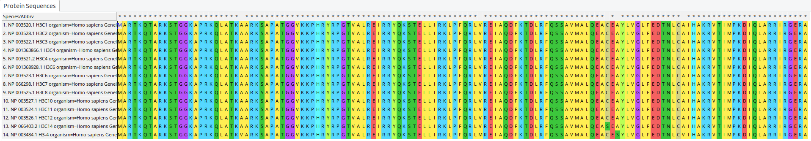
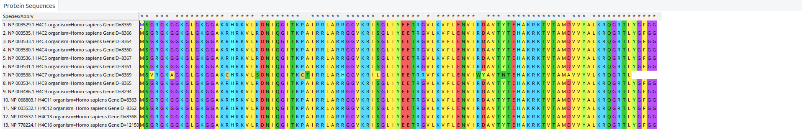

# Индивидуальная часть

Гистоновая метка H3K36me

Белок KDM4A

## Краткое описание

Белок связан с модификацией H3K36me

_Функция_: Histone modification erase. Функционирует как деметилаза, преобразующая специфические триметилированные остатки гистона в диметилированную форму, и как репрессор транскрипции

_Статьи_: 

[CTCF-KDM4A complex correlates with histone modifications that negatively regulate CHD5 gene expression in cancer cell lines](https://pubmed.ncbi.nlm.nih.gov/29682202/)

[Fisetin inhibits proliferation of pancreatic adenocarcinoma by inducing DNA damage via RFXAP/KDM4A-dependent histone H3K36 demethylation](https://www.nature.com/articles/s41419-020-03019-2)

_Комплексы_: -

_Ткани_: фибробласты, кожа, мозг, надпочечниковая железа, щитовидная железа

_Домены_: JmjC, JmjN, TUDOR, PHD

## Выравнивания гистонов

Сделаны с помощью MEGAX.

### H2A

### H2B

### H3

### H4

## Таблички

### E-value

|      |human   |mouse   |zebrafish|drosophila|c.elegans|ciliate |yeast   |methanocaldococcus|thermococcus|e.coli|tuberculosis|
|------|--------|--------|---------|----------|---------|--------|--------|------------------|------------|------|------------|
|H2A   |4.94e-91|4.57e-84|1.06e-81 |2.34e-69  |6.53e-67 |2.45e-57|8.88e-63|0.001             |0.15        |1.2   |0.4         |
|H2B   |2.85e-87|1.15e-83|1.85e-71 |3.3e-59   |5.28e-65 |1.91e-49|3.07e-57|2.6               |0.17        |1.8   |2.2         |
|H3    |2.19e-96|1.54e-96|1.77e-95 |9.39e-96  |4.46e-94 |8.41e-86|3.31e-87|0.034             |0.057       |0.9   |4.6         |
|H4    |1.09e-67|7.6e-68 |1.13e-68 |8.02e-68  |6.15e-68 |1.96e-45|1.08e-52|8.22e-05          |3.31e-05    |1.3   |0.069       |
|kdm4a |0.0     |0.0     |0.0      |2.42e-159 |1.59e-100|6.11e-78|5.28e-75|0.015             |6.2         |0.18  |5.4         |

### -log(E-value)

|FIELD1|human   |mouse   |zebrafish|drosophila|c.elegans|ciliate |yeast   |methanocaldococcus|thermococcus|e.coli|tuberculosis|
|------|--------|--------|---------|----------|---------|--------|--------|------------------|------------|------|------------|
|H2A   |90.30627305107636|83.34008379993016|80.97469413473523|68.63078414258986|66.18508681872493|56.61083391563547|62.0515870342214|3.0               |0.8239087409443188|-0.07918124604762482|0.3979400086720376|
|H2B   |86.5451551399915|82.93930215964639|70.73282827159699|58.481486060122116|64.27736607746618|48.71896663275227|56.51286162452281|-0.414973347970818|0.7695510786217261|-0.25527250510330607|-0.3424226808222063|
|H3    |95.65955588515988|95.81247927916354|94.75202673363819|95.02733440773389|93.35066514128786|85.07520400420209|86.48017200622428|1.4685210829577449|1.2441251443275085|0.045757490560675115|-0.6627578316815741|
|H4    |66.96257350205937|67.11918640771921|67.94692155651659|67.09582563171584|67.21112488422459|44.707743928643524|51.96657624451305|4.0851281824599495|4.480172006224281|-0.11394335230683678|1.1611509092627446|
|kdm4a |300.0   |300.0   |300.0    |158.61618463401956|99.79860287567955|77.21395878975744|74.27736607746618|1.8239087409443189|-0.7923916894982539|0.744727494896694|-0.7323937598229685|

### Heatmap

