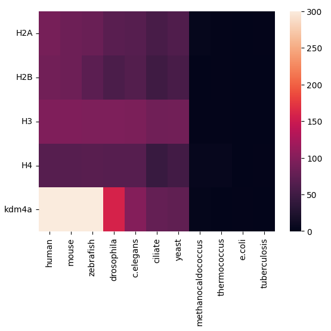

# Индивидуальная часть

Гистоновая метка H3K36me

Белок KDM4A

## Краткое описание

Белок связан с модификацией H3K36me

_Функция_: Histone modification erase. Функционирует как деметилаза, преобразующая специфические триметилированные остатки гистона в диметилированную форму, и как репрессор транскрипции

_Статьи_: 

[CTCF-KDM4A complex correlates with histone modifications that negatively regulate CHD5 gene expression in cancer cell lines](https://pubmed.ncbi.nlm.nih.gov/29682202/)

[Fisetin inhibits proliferation of pancreatic adenocarcinoma by inducing DNA damage via RFXAP/KDM4A-dependent histone H3K36 demethylation](https://www.nature.com/articles/s41419-020-03019-2)

_Комплексы_: -

_Ткани_: фибробласты, кожа, мозг, надпочечниковая железа, щитовидная железа

_Домены_: JmjC, JmjN, TUDOR, PHD

## Выравнивания гистонов

Сделаны с помощью MEGAX.

### H2A

### H2B

### H3

### H4

### Вывод

В H3 и H4 все последовательности практически идентичны, поэтому они точно кодируют один и тот же ген. 

Для H2A и H2B много похожих последовательностей, но есть и немного отличающиеся. Возможно это связано с тем, что функции похожие, но псоледовательности разные.

## Таблички

Ссылка на colab с ними https://colab.research.google.com/drive/1U3zkIWSJkBnlBHgwfa-fKIIKUMRcZA2Q?usp=sharing

### E-value

|      |human   |mouse   |zebrafish|drosophila|c.elegans|ciliate |yeast   |methanocaldococcus|thermococcus|e.coli|tuberculosis|
|------|--------|--------|---------|----------|---------|--------|--------|------------------|------------|------|------------|
|H2A   |4.94e-91|4.57e-84|1.06e-81 |2.34e-69  |6.53e-67 |2.45e-57|8.88e-63|0.001             |0.15        |1.2   |0.4         |
|H2B   |2.85e-87|1.15e-83|1.85e-71 |3.3e-59   |5.28e-65 |1.91e-49|3.07e-57|2.6               |0.17        |1.8   |2.2         |
|H3    |2.19e-96|1.54e-96|1.77e-95 |9.39e-96  |4.46e-94 |8.41e-86|3.31e-87|0.034             |0.057       |0.9   |4.6         |
|H4    |1.09e-67|7.6e-68 |1.13e-68 |8.02e-68  |6.15e-68 |1.96e-45|1.08e-52|8.22e-05          |3.31e-05    |1.3   |0.069       |
|kdm4a |0.0     |0.0     |0.0      |2.42e-159 |1.59e-100|6.11e-78|5.28e-75|0.015             |6.2         |0.18  |5.4         |

### -log(E-value)

|FIELD1|human            |mouse            |zebrafish        |drosophila        |c.elegans        |ciliate           |yeast            |methanocaldococcus|thermococcus       |e.coli              |tuberculosis       |
|------|-----------------|-----------------|-----------------|------------------|-----------------|------------------|-----------------|------------------|-------------------|--------------------|-------------------|
|H2A   |90.30 |83.34 |80.97 |68.63  |66.19 |56.61 |62.05 |3.0   |0.82  |-0.08 |0.39 |
|H2B   |86.54 |82.94 |70.73 |58.48  |64.28 |48.72 |56.51 |-0.41 |0.77  |-0.26 |-0.34 |
|H3    |95.66 |95.81 |94.75 |95.03  |93.35 |85.08 |86.48 |1.47  |1.24  |0.046 |-0.66 |
|H4    |66.96 |67.12 |67.95 |67.09  |67.21 |44.70 |51.97 |4.09  |4.48  |-0.11 |1.16 |
|kdm4a |300.0 |300.0 |300.0 |158.62 |99.79 |77.21 |74.28 |1.82  |-0.79 |0.74  |-0.73 |

### Heatmap

## Выводы

